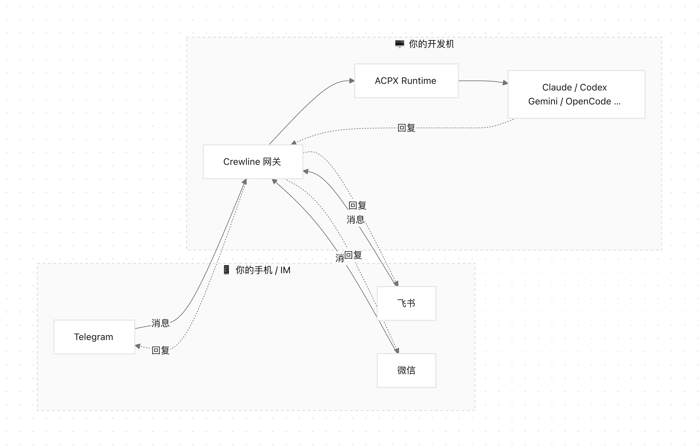
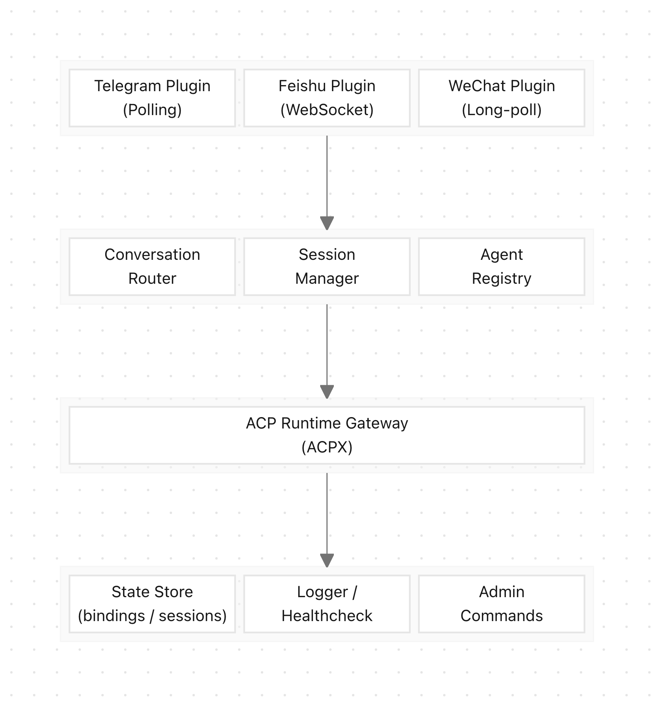

# Crewline：用微信、飞书远程控制你的Claude Code、Codex

> 开源项目地址：https://github.com/rongyan6/crewline
> 中文文档：https://github.com/rongyan6/crewline/blob/main/README.zh-CN.md

---

## 一、Crewline 是什么？

你是否有过这样的体验：在手机上想让 Claude Code 帮忙改个 bug，却发现自己必须守在电脑终端前？

**Crewline** 是一个轻量级的消息网关，它将你的即时通讯工具（微信、飞书、Telegram）变成 AI 编程 Agent 的遥控器。它通过 ACP（Agent Client Protocol）协议，将消息平台与本地运行的编程 Agent（Claude Code、Codex CLI、Gemini CLI、OpenCode 等 16 种）桥接在一起。

简单来说——**你在微信/飞书/Telegram 上发一条消息，就能驱动你本地机器上的 AI Agent 去写代码、改 bug、做重构。**



### 分层架构

Crewline 采用清晰的四层架构，每层职责单一、边界明确：



> **Channel Layer** 将三大平台的协议差异抹平为统一的 `InboundMessage` / `OutboundMessage`；<br>
> **Core Layer** 负责会话路由、Session 生命周期和 Agent 实例管理；<br>
> **Runtime Layer** 通过 ACPX 统一对接 16 种 ACP Agent；<br>
> **State & Observability** 持久化绑定关系和会话状态，提供日志、健康检查与远程管理入口。

---

## 二、Crewline 的亮点与特色

### 1. 真正的多平台 IM 支持：微信、飞书、Telegram

这不是"只支持 Telegram"的玩具项目。Crewline 从第一天就设计了统一的消息抽象层（`InboundMessage` / `OutboundMessage`），将三大平台的协议差异封装在 Channel Plugin 内部：

| 平台 | 连接方式 | 私聊 | 群组 | Topic |
|------|---------|:----:|:----:|:-----:|
| **Telegram** | Polling | ✅ | ✅ | ✅ |
| **飞书** | WebSocket | ✅ | ✅ | — |
| **微信** | Long-poll | ✅ | — | — |

对于国内团队而言，**飞书和微信的支持是真正的刚需**——这是同类项目几乎都没有覆盖的领域。

### 2. 多机器人账号

每个平台支持配置多个 Bot 账号。一个 Telegram Bot 负责前端项目，另一个负责后端项目，各自绑定不同的 Agent 实例和工作目录——井井有条。

```json
{
  "accounts": {
    "bot_frontend": {
      "botToken": "...",
      "bindings": { "dm": { "userId": { "instanceId": "claude_fe" } } }
    },
    "bot_backend": {
      "botToken": "...",
      "bindings": { "dm": { "userId": { "instanceId": "codex_be" } } }
    }
  }
}
```

### 3. 群组与 Topic 支持

不只是私聊。你可以把 Agent 绑定到一个 Telegram 群组、甚至群组内的某个 Topic。团队成员在群里 @bot 提问，Agent 回答——这就是协作。

### 4. 多 Agent 架构

Crewline 采用 **Provider + Instance** 的两层模型：

- **Provider** 定义 Agent 类型（`claude`、`codex`、`gemini`、`opencode`...共 16 种）
- **Instance** 定义具体实例（绑定特定的工作目录 `cwd`）

你可以同时运行多个不同类型、不同项目的 Agent 实例，通过消息路由精准分发到对应的会话。

### 5. 远程管理命令（`/admin_*`）

无需 SSH 到服务器，直接在 IM 里管理你的 Agent 集群：

| 命令 | 功能 |
|------|------|
| `/admin_help` | 查看命令列表 |
| `/admin_status` | 查看服务运行状态 |
| `/admin_health` | 健康检查摘要 |
| `/admin_doctor` | 配置/通道诊断 |
| `/admin_agents` | 列出所有 Agent 实例 |
| `/admin_user` | 把指定用户加入当前通道的管理名单 |
| `/admin_agent_add` | 动态添加 Agent 实例 |
| `/admin_agent_cwd` | 更新工作目录 |
| `/admin_reg` | 注册当前会话绑定 |
| `/admin_stop` / `/admin_restart` | 远程停止/重启服务 |

这意味着你可以在手机上随时掌控全局。

### 6. 会话内置命令

除了 `/admin_*`，Crewline 还支持自己处理一小组会话内置命令。

- `/reset`：只重建当前 Agent 的 runtime 会话，不清空聊天记录，也不改变当前绑定
- `/new` 不属于 Crewline 内置命令；如果底层 Agent provider 支持，Crewline 只会透传
- 后续还会继续补充更多内置命令

### 7. 会话管理与自动恢复

每个对话维持一个 **Sticky Session**，Agent 记住上下文。会话断开？Crewline 会自动尝试恢复，恢复失败才重建——不会莫名其妙地丢失对话历史。

---

## 三、与其他项目的差异对比

市面上已经有几个相关项目。Crewline 不是在重复造轮子——它填补的是一个非常具体的空白。

### vs OpenClaw ACP

[OpenClaw](https://docs.openclaw.ai/tools/acp-agents) 及其 [ACPX](https://github.com/openclaw/acpx) 解决的是 **IDE ↔ Agent** 的桥接问题：让你在 VS Code、Zed 等编辑器里调用 Claude Code、Codex 等 Agent。

| 维度 | OpenClaw ACP | Crewline |
|------|-------------|----------|
| **连接的是什么** | IDE / 编辑器 | IM 消息平台 |
| **交互场景** | 坐在电脑前写代码 | 离开电脑后远程操控 |
| **多 Agent** | 单会话单 Agent | 多实例并行，路由分发 |
| **群组协作** | 不涉及 | 群组/Topic 绑定 |
| **远程管理** | 无 | 完整 `/admin_*` 命令集 |

**关系而非竞争**：Crewline 的 Runtime 层正是基于 ACPX 构建的。OpenClaw 做的是"让 Agent 说 ACP"，Crewline 做的是"让 IM 说 ACP"。

### vs Happy

[Happy](https://happy.engineering/) 的定位是"从任何设备控制你本地的 AI Agent"。它通过 Web/移动端界面远程连接到你的 Claude Code 实例，支持多实例并行。2026 年还推出了实验性的 Channels 功能（Discord、Telegram）。

| 维度 | Happy | Crewline |
|------|-------|----------|
| **IM 平台** | Discord、Telegram（实验性） | Telegram + 飞书 + 微信 |
| **中国生态** | 不支持 | 飞书 + 微信原生支持 |
| **多 Bot 账号** | 不涉及 | 每平台多账号 |
| **群组/Topic** | 不涉及 | 完整支持 |
| **管理方式** | Web 面板 | IM 内 `/admin_*` 命令 |
| **Agent 绑定** | 仅 Claude Code | 16 种 ACP Agent |
| **开源** | 非开源 | 完全开源 |

Happy 更像是一个"Claude Code 的移动端伴侣"。Crewline 是一个**通用 IM 网关**，不绑定特定 Agent，不绑定特定平台。

### vs Claude Code Remote Control / Channels

Anthropic 官方为 Claude Code 推出了两个远程能力：

- **[Remote Control](https://code.claude.com/docs/en/remote-control)**：将终端会话同步到 claude.ai 网页和手机 App
- **[Channels](https://claudefa.st/blog/guide/development/claude-code-channels)**：通过 MCP Server 桥接 Telegram/Discord/iMessage

| 维度 | Claude Code Channels | Crewline |
|------|---------------------|----------|
| **支持的 Agent** | 仅 Claude Code | 16 种（Claude、Codex、Gemini…） |
| **IM 平台** | Telegram、Discord、iMessage | Telegram + 飞书 + 微信 |
| **中国生态** | 不支持 | 飞书 + 微信 |
| **多 Bot 账号** | 不支持 | 支持 |
| **群组/Topic** | 不支持 | 支持 |
| **远程管理** | 无 | `/admin_*` 命令集 |
| **多 Agent 路由** | 无 | 基于会话的路由分发 |
| **架构** | MCP Server 插件 | 独立网关服务 |

Claude Code Channels 是一个 MCP 插件，它的目标是让你"在 Telegram 里跟 Claude Code 聊天"。Crewline 是一个独立的网关服务，目标是**让任意 IM 平台驱动任意 ACP Agent**。

### 差异总结

```
                    IDE集成    IM集成    多Agent    多Bot    群组    中国IM    远程管理    开源
OpenClaw ACP          ✅        ❌        ❌        ❌      ❌      ❌        ❌        ✅
Happy                 ❌        ⚠️        ⚠️        ❌      ❌      ❌        ⚠️        ❌
Claude Channels       ❌        ⚠️        ❌        ❌      ❌      ❌        ❌        ✅
Crewline              ❌        ✅        ✅        ✅      ✅      ✅        ✅        ✅
```
> ⚠️ = 部分支持或实验性

---

## 四、典型使用场景

**场景 1：独立开发者的移动办公**
在地铁上打开 Telegram，给你的 Claude Code Agent 发一条消息："把 `UserService` 的分页逻辑重构成 cursor-based pagination"。到公司打开电脑，代码已经改好了。

**场景 2：团队协作**
在飞书群组里绑定一个 Codex Agent 实例，团队成员 @bot 就能让它帮忙 code review、写测试、查问题——共享同一个项目上下文。

**场景 3：多项目管理**
配置 3 个 Telegram Bot，分别绑定前端、后端、基础设施的 Agent 实例。用 `/admin_agents` 一览全局，用 `/admin_agent_cwd` 随时切换项目目录。

---

## 五、快速开始

```bash
# 安装
npm install -g crewline

# 初始化配置
crewline init

# 编辑 ~/.crewline/crewline.json 配置你的 Bot 和 Agent

# 验证配置
crewline doctor

# 启动服务
crewline start

# 查看当前服务状态（macOS 下预期是 launchd）
crewline status
```

现在在 macOS 上，`crewline start` 会自动通过 `launchd` 启动正式服务；`crewline stop` 和 `crewline restart` 也会顺带清理本机残留的 Crewline 进程，避免多个实例同时在线。

---

## 六、写在最后

Crewline 的核心主张很简单：

> **AI 编程 Agent 不应该被锁在终端和 IDE 里。它们应该去到开发者真正待的地方——IM 消息窗口。**

OpenClaw 让 Agent 走进了 IDE，Happy 让 Agent 走上了 Web，Claude Code Channels 让 Agent 走进了 Telegram。而 Crewline 要做的是——**让任意 Agent 走进任意 IM**，尤其是中国开发者每天都在用的飞书和微信。

它是开源的、免费的、轻量的。欢迎 Star、Fork、PR。

> GitHub：https://github.com/rongyan6/crewline
